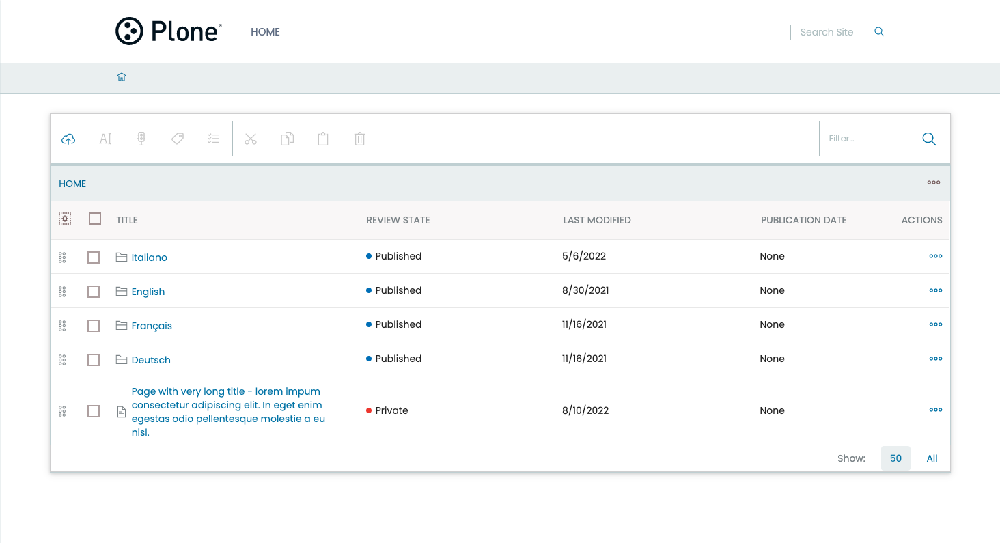
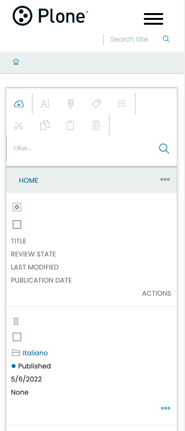

# volto-wide-content-folder

Volto addon to expand horizontally the content folder.

Install with mrs-developer (see [Volto docs](https://docs.voltocms.com/customizing/add-ons/)) or with:

```bash
yarn add volto-wide-content-folder
```

The contents folder on desktop expands by 90% of the screen while on mobile and tablet devices it remains unchanged, even the very long table titles wrap.



On mobile the toolbar of the content folder fits according to the screen size.


