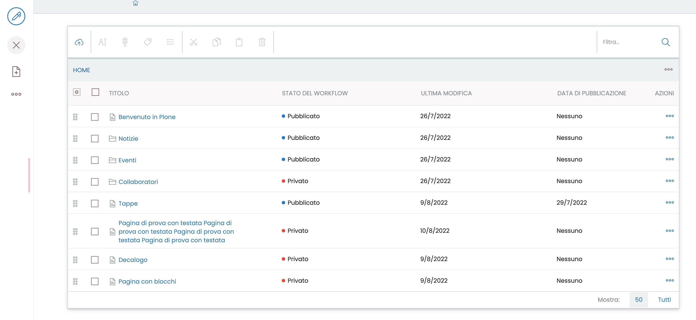

# volto-wide-content-folder

Volto addon to expand horizontally the content folder.

Install with mrs-developer (see [Volto docs](https://docs.voltocms.com/customizing/add-ons/)) or with:

```bash
yarn add volto-wide-content-folder
```


